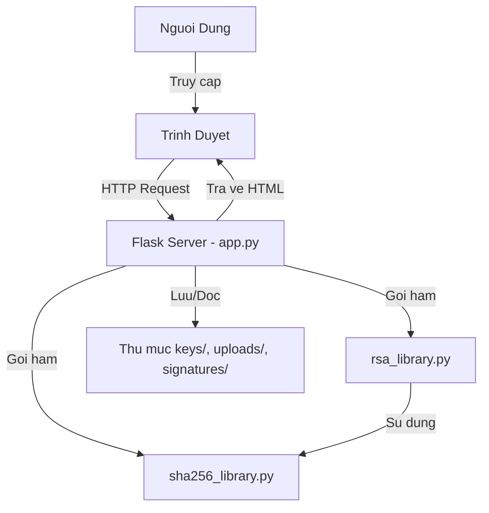

# PHAN TICH CHI TIET HE THONG CHU KY SO (Detailed Analysis)

Tai lieu nay phan tich toan bo logic hoat dong cua he thong, tu thuat toan toan hoc den luong du lieu thuc te.

---

## 1. TONG QUAN HE THONG

### Sơ Đồ Kiến Trúc



### Luồng Hoạt Động Chính

**LUONG 1: TAO KHOA**
```
User bam "Tao Khoa" 
  → Flask route /tao_khoa
  → Goi rsa_library.tao_cap_khoa_rsa(1024)
    → tao_so_nguyen_to(512) cho p
    → tao_so_nguyen_to(512) cho q  
    → Tinh n = p * q
    → Tinh phi = (p-1)(q-1)
    → Chon e = 65537
    → Tinh d = nghich_dao_module(e, phi)
  → Luu Private Key (d,n) va Public Key (e,n) vao files
  → Tra ve trang web voi nut download
```

**LUONG 2: KY FILE**
```
User upload [File] + [Private Key (optional)]
  → Flask route /ky_file
  → Doc file → du_lieu_bytes
  → Doc Private Key (rieng hoac chung)
  → Goi rsa_library.ky_so_rsa(du_lieu_bytes, khoa_bi_mat)
    → Goi sha256_library.tinh_hash_sha256(du_lieu_bytes)
      → Padding du lieu (them bit 1, bit 0, do dai)
      → Chia thanh cac khoi 512-bit
      → Vong lap nen 64 buoc cho moi khoi
      → Tra ve digest (hex 64 ky tu)
    → Chuyen digest thanh so nguyen m
    → Tinh s = m^d mod n (Modular Exponentiation)
    → Tra ve chu ky s duoi dang hex
  → Luu chu ky vao file .sig
  → Xoa Private Key tam neu co
  → Tra ve ket qua
```

**LUONG 3: XAC THUC**
```
User upload [File] + [Signature .sig] + [Public Key]
  → Flask route /kiem_tra
  → Doc file → du_lieu_bytes
  → Doc chu ky s tu file .sig
  → Doc Public Key
  → Goi rsa_library.xac_thuc_chu_ky(...)
    → Tinh hash cua file goc: m = SHA256(du_lieu_bytes)
    → Giai ma chu ky: m' = s^e mod n
    → So sanh: m == m' ?
      → Neu BANG → Hop le (True)
      → Neu KHAC → Khong hop le (False)
  → Hien thi ket qua
```

---

## 2. PHAN TICH CHI TIET TUNG FILE

### A. sha256_library.py - THU VIEN BAM

**Mục đích**: Tao ra "van tay" (fingerprint) duy nhat cho du lieu.

#### Buoc 1: Padding (Dem Du Lieu)
```python
# Vi du: "Hello" (5 bytes = 40 bits)
thong_diep = b"Hello"
chieu_dai = 40  # Luu lai do dai goc

# Them bit 1
thong_diep += b'\x80'  # "Hello\x80"

# Them bit 0 cho den khi (do_dai_bit mod 512) = 448
# 40 + 8 = 48 bit → Can them 400 bit (50 bytes) de len 448 bit
while (len(thong_diep) * 8) % 512 != 448:
    thong_diep += b'\x00'

# Them do dai goc (40) dang 64-bit cuoi cung
# Tong: 448 + 64 = 512 bit (1 khoi)
thong_diep += (40).to_bytes(8, 'big')
```

#### Buoc 2: Xu Ly Tung Khoi 512-bit
```python
# Chia khoi thanh 16 tu 32-bit
w = [0] * 64
for j in range(16):
    w[j] = int.from_bytes(khoi[j*4:j*4+4], 'big')

# Mo rong thanh 64 tu bang cong thuc SHA-256
for j in range(16, 64):
    s0 = xoay_phai(w[j-15], 7) ^ xoay_phai(w[j-15], 18) ^ (w[j-15] >> 3)
    s1 = xoay_phai(w[j-2], 17) ^ xoay_phai(w[j-2], 19) ^ (w[j-2] >> 10)
    w[j] = (w[j-16] + s0 + w[j-7] + s1) & 0xFFFFFFFF
```

#### Buoc 3: Vong Lap Nen (64 vong)
```python
# 8 bien lam viec: a, b, c, d, e, f, g, h
# Moi vong lap:
for j in range(64):
    # Tinh toan cac ham toan hoc
    S1 = xoay_phai(e, 6) ^ xoay_phai(e, 11) ^ xoay_phai(e, 25)
    ch = (e & f) ^ ((~e) & g)  # Ham "choice"
    temp1 = h + S1 + ch + K[j] + w[j]
    
    S0 = xoay_phai(a, 2) ^ xoay_phai(a, 13) ^ xoay_phai(a, 22)
    maj = (a & b) ^ (a & c) ^ (b & c)  # Ham "majority"
    temp2 = S0 + maj
    
    # Dich chuyen cac bien (rotate)
    h = g
    g = f
    f = e
    e = d + temp1
    d = c
    c = b
    b = a
    a = temp1 + temp2
```

**Ket qua**: Sau khi xu ly xong tat ca cac khoi, ghep `h0...h7` thanh chuoi hex 256-bit.

#### Vi Du Cu The
```
Input: "Hello"
SHA-256: 185f8db32271fe25f561a6fc938b2e264306ec304eda518007d1764826381969
```
Neu thay doi 1 ky tu thanh "hello" (chu h thuong):
```
SHA-256: 2cf24dba5fb0a30e26e83b2ac5b9e29e1b161e5c1fa7425e73043362938b9824
```
→ **Hoan toan khac nhau!**

---

### B. rsa_library.py - THU VIEN RSA

**Mục đích**: Ma hoa/Giai ma dua tren do kho phan tich thua so nguyen to.

#### 1. Kiem Tra Nguyen To (Miller-Rabin)

**Tai sao can?** Khoa RSA can 2 so nguyen to rat lon (512 bit). Khong kha thi kiem tra tung so tu 1 den 2^512.

**Nguyen ly:**
- Dua tren dinh ly Fermat: Neu `p` la nguyen to, thi voi moi `a`: `a^(p-1) ≡ 1 (mod p)`.
- Miller-Rabin them cac buoc kiem tra manh hon de giam sai so.

**Code:**
```python
def kiem_tra_nguyen_to(n, k=40):
    # Viet n-1 = 2^r * d (d le)
    r, d = 0, n - 1
    while d % 2 == 0:
        r += 1
        d //= 2
    
    # Kiem tra k lan (k=40 → do chinh xac 99.9999999%)
    for _ in range(k):
        a = random.randrange(2, n - 1)  # Chon so ngau nhien
        x = pow(a, d, n)  # Tinh a^d mod n
        
        # Kiem tra dieu kien Fermat mo rong
        if x == 1 or x == n - 1:
            continue  # Co the la nguyen to
        
        for _ in range(r - 1):
            x = pow(x, 2, n)
            if x == n - 1:
                break
        else:
            return False  # Chac chan la hop so
    
    return True  # Rat co kha nang la nguyen to
```

**Vi du**: Kiem tra `n = 17`
- `n-1 = 16 = 2^4 * 1` → `r=4, d=1`
- Chon `a=3`: `3^1 mod 17 = 3`
- Kiem tra: `3^2 = 9`, `3^4 = 13`, `3^8 = 16 ≡ -1` → PASS

#### 2. Tao Khoa (Key Generation)

**Input**: Kich thuoc khoa (vi du 1024 bit)

**Output**: 
- Public Key: `(e, n)`
- Private Key: `(d, n)`

**Cac buoc:**
```python
def tao_cap_khoa_rsa(kich_thuoc_khoa=1024):
    # Buoc 1: Tao 2 so nguyen to p, q (moi so 512 bit)
    p = tao_so_nguyen_to(512)  # Vi du: p = 12345678901234567...
    q = tao_so_nguyen_to(512)  # Vi du: q = 98765432109876543...
    
    # Buoc 2: Tinh n (Module cong khai)
    n = p * q  # n ≈ 1024 bit
    
    # Buoc 3: Tinh Phi(n) - Ham Euler
    phi = (p - 1) * (q - 1)
    
    # Buoc 4: Chon e (So mu cong khai)
    e = 65537  # So nguyen to Fermat F4, pho bien vi nhanh
    # Dieu kien: gcd(e, phi) = 1
    
    # Buoc 5: Tinh d (So mu bi mat)
    # Can tim d sao cho: d * e ≡ 1 (mod phi)
    d = nghich_dao_module(e, phi)
    # Vi du: Neu e*d = 1234*phi + 1 → d = (1234*phi + 1) / e
    
    return ((e, n), (d, n))
```

**Vi du cu the** (So nho de de hieu):
```
p = 61, q = 53
n = 61 * 53 = 3233
phi = (61-1) * (53-1) = 3120
e = 17 (thoa man gcd(17, 3120) = 1)
d = 2753 (vi 17 * 2753 mod 3120 = 1)

Public Key: (17, 3233)
Private Key: (2753, 3233)
```

#### 3. Ky So (Signing)

**Muc dich**: Tao "dau cham" (signature) chi nguoi giu Private Key moi tao duoc.

```python
def ky_so_rsa(du_lieu_bytes, khoa_bi_mat):
    d, n = khoa_bi_mat  # (2753, 3233)
    
    # Buoc 1: Bam du lieu
    m = tinh_hash_sha256(du_lieu_bytes)  
    # Vi du: m = 123456789... (so rat lon)
    
    # Buoc 2: "Ma hoa" bang Private Key
    chu_ky = pow(m, d, n)  # s = m^d mod n
    # Vi du: s = 123456789^2753 mod 3233 = ???
    
    return hex(chu_ky)  # Tra ve dang hex
```

**Tai sao dung mo-dun luy thua?**
- Tinh truc tiep `m^d` se qua lon (hang nghin chu so).
- Ham `pow(m, d, n)` dung thuat toan "Nhan-Binh Phuong" (Square-and-Multiply):
  - Chia `d` thanh cac bit nhi phan.
  - Chi thuc hien phep nhan va binh phuong, luon modulo `n`.
  - Do phuc tap: O(log d).

**Vi du**:
```
Du lieu: "Hello World"
Hash: m = 185f8db32271fe25... (chuyen thanh so nguyen)
Private Key: (d=2753, n=3233)
Chu ky: s = m^2753 mod 3233 = abc123def... (hex)
```

#### 4. Xac Thuc (Verification)

**Muc dich**: Kiem tra chu ky co hop le khong (khong can Private Key).

```python
def xac_thuc_chu_ky(du_lieu_bytes, chu_ky_hex, khoa_cong_khai):
    e, n = khoa_cong_khai  # (17, 3233)
    
    # Buoc 1: Tinh hash cua du lieu goc
    m = tinh_hash_sha256(du_lieu_bytes)
    
    # Buoc 2: "Giai ma" chu ky bang Public Key
    chu_ky_int = int(chu_ky_hex, 16)
    m_phay = pow(chu_ky_int, e, n)  # m' = s^e mod n
    
    # Buoc 3: So sanh
    return m == m_phay  # Neu bang → Hop le!
```

**Tai sao lai hop le?**
- Vi: `s = m^d mod n`
- Nen: `s^e = (m^d)^e = m^(d*e) mod n`
- Do `d*e ≡ 1 (mod phi)` nen `m^(d*e) ≡ m (mod n)`
- Ket luan: `s^e mod n = m` → Xac thuc thanh cong!

**Vi du**:
```
File goc: "Hello World" → Hash: m = 185f8...
Chu ky: s = abc123...
Public Key: (e=17, n=3233)
Tinh: m' = (abc123...)^17 mod 3233 = 185f8...
So sanh: m' == m → TRUE → Hop le!
```

---

### C. app.py - SERVER BACKEND

**Vai tro**: Ket noi giua giao dien web va logic toan hoc.

#### Route 1: /tao_khoa (POST)
```python
@app.route('/tao_khoa', methods=['POST'])
def route_tao_khoa():
    try:
        # Goi ham tao khoa
        xu_ly_tao_khoa()  
        # → Ben trong goi: tao_cap_khoa_rsa(1024)
        # → Luu ra: keys/private_key.pem, keys/public_key.pem
        
        # Tra ve trang web voi thong bao thanh cong
        return render_template('index.html', 
            message="Da Tao Khoa Thanh Cong!",
            private_key_file="private_key.pem",  # Cho phep download
            public_key_file="public_key.pem"
        )
    except Exception as e:
        return render_template('index.html', message=f"Loi: {e}")
```

#### Route 2: /ky_file (POST)
```python
@app.route('/ky_file', methods=['POST'])
def route_ky_file():
    # Nhan file tu user
    file = request.files['file']  # File can ky
    private_key_file = request.files.get('private_key')  # Optional
    
    # Luu file tam
    file.save("uploads/document.pdf")
    
    # Kiem tra: User co upload Private Key rieng khong?
    if private_key_file:
        # Dung khoa rieng
        private_key_file.save("uploads/temp_private.pem")
        chu_ky = xu_ly_ky_file("uploads/document.pdf", "uploads/temp_private.pem")
        os.remove("uploads/temp_private.pem")  # XOA NGAY!
    else:
        # Dung khoa chung tren server
        chu_ky = xu_ly_ky_file("uploads/document.pdf")
    
    # Tra ve ket qua
    return render_template('index.html', 
        message="Da ky thanh cong!",
        signature_file="document.pdf.sig"
    )
```

**Diem quan trong**: Neu user upload Private Key rieng, server chi dung tam roi XOA NGAY → Bao mat!

#### Route 3: /kiem_tra (POST)
```python
@app.route('/kiem_tra', methods=['POST'])
def route_kiem_tra():
    file = request.files['file']  # File goc
    signature = request.files['signature']  # File .sig
    
    # Luu tam
    file.save("uploads/document.pdf")
    signature.save("signatures/document.pdf.sig")
    
    # Goi ham xac thuc
    ket_qua = xu_ly_xac_thuc(
        "uploads/document.pdf",
        "signatures/document.pdf.sig"
    )
    
    if ket_qua:
        return render_template('index.html', 
            message="✅ File Hop Le - Toan Ven Du Lieu!",
            message_type="success"
        )
    else:
        return render_template('index.html',
            message="❌ Canh Bao - File Bi Sua Doi!",
            message_type="error"
        )
```

---

## 3. VI DU THUC TE (STEP-BY-STEP)

### Kich Ban: Alice Ky Hop Dong GUI Cho Bob

**Buoc 1: Alice Tao Khoa**
```
Alice truy cap ung dung → Bam "Tao Cap Khoa"
Server tao:
  - Private Key: (d=123abc..., n=789def...)
  - Public Key: (e=65537, n=789def...)
Alice tai Private Key ve USB cua minh
Alice chia se Public Key cho moi nguoi (co the dang len mang)
```

**Buoc 2: Alice Ky Hop Dong**
```
Alice co file "hop_dong.pdf"
Alice upload:
  - File: hop_dong.pdf
  - Private Key: (tu USB - alice_private.pem)
Server xu ly:
  1. Doc hop_dong.pdf → 12KB du lieu
  2. Tinh SHA-256 → m = a1b2c3d4...
  3. Dung Private Key cua Alice → s = m^d mod n
  4. Luu chu ky → hop_dong.pdf.sig
  5. XOA alice_private.pem (da dung xong)
Alice nhan file chu ky "hop_dong.pdf.sig"
```

**Buoc 3: Alice Gui Cho Bob**
```
Alice gui 3 file cho Bob qua email:
  1. hop_dong.pdf (File goc)
  2. hop_dong.pdf.sig (Chu ky)
  3. alice_public.pem (Public Key cua Alice)
```

**Buoc 4: Bob Xac Thuc**
```
Bob upload len ung dung:
  - File goc: hop_dong.pdf
  - File chu ky: hop_dong.pdf.sig
  - Public Key: alice_public.pem (hoac da co san)
Server xu ly:
  1. Tinh hash file goc → m = a1b2c3d4...
  2. Doc chu ky → s = xyz789...
  3. Giai ma: m' = s^e mod n
  4. So sanh: m' == m ?
Ket qua: "✅ File Hop Le!"
→ Bob biet hop dong chinh xac tu Alice, khong bi sua doi!
```

**Buoc 5: Neu Co Nguoi Hack**
```
Hacker chen vao hop_dong.pdf: "Them 1 trieu dong"
Hacker khong co Private Key cua Alice → Khong tao duoc chu ky moi
Bob xac thuc:
  - Hash file bi sua → m_hack = zzz999... (KHAC voi m goc)
  - Giai ma chu ky cu → m' = a1b2c3d4... (Cu)
  - So sanh: m_hack != m' → "❌ File Bi Sua Doi!"
```

---

## 4. TAI SAO BAO MAT?

### Bao Mat Cua SHA-256
- **Khong dao nguoc**: Biet hash, khong the suy ra du lieu goc.
- **Chong va cham**: Rat kho tim 2 file khac nhau co cung hash.
- **Nhanh + On dinh**: Chuan cong nghiep (Bitcoin, SSL,...).

### Bao Mat Cua RSA
- **Do kho toan hoc**: Phan tich n = p * q la bai toan NP (mat hang nam voi so 1024-bit).
- **Private Key an toan**: Chi Alice giu, khong ai khac biet.
- **Public Key cong khai**: Moi nguoi biet, khong sao → Van khong the gia mao chu ky.

### Ung Dung Thuc Te
- **Gmail/Email**: DKIM (DomainKeys Identified Mail) dung RSA.
- **HTTPS**: Chung chi SSL/TLS dung RSA de xac thuc may chu.
- **Code Signing**: Windows, Mac dung de xac thuc phan mem.

---

## 5. KET LUAN - DIEM MANH CUA DO AN

✅ **Toan hoc vung chac**: Tu viet toan bo thuat toan Miller-Rabin, Euclid Mo Rong, SHA-256 theo tieu chuan FIPS.

✅ **Code thuan 100%**: Khong dung thu vien co san, cho thay hieu sau sac nguyen ly.

✅ **Bao mat thuc te**: Cho phep user su dung Private Key rieng → Tuong tu he thong PKI thuc te.

✅ **Giao dien than thien**: De dang demo va giai thich.

---

**Loi Khuyen Khi Giai Trinh:**
1. Bat dau tu vi du don gian (so nho) de thay ro nguyen ly RSA.
2. Giai thich tai sao SHA-256 can thiet (tranh ky truc tiep file lon).
3. Nhan manh phan bao mat (Private Key khong nen luu server).
4. Demo truc tiep: Tao khoa → Ky → Xac thuc → Sua file → Xac thuc lai (fail).
